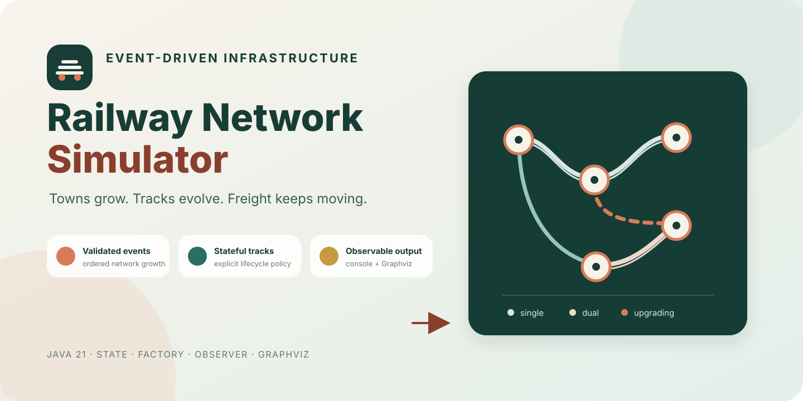
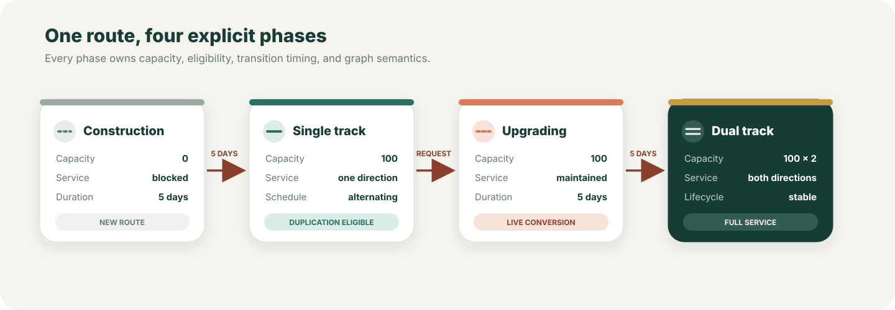
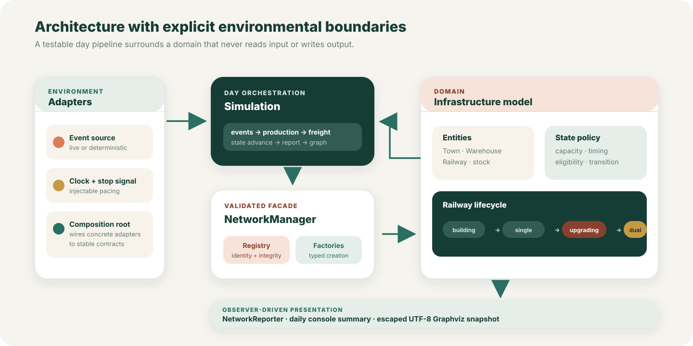
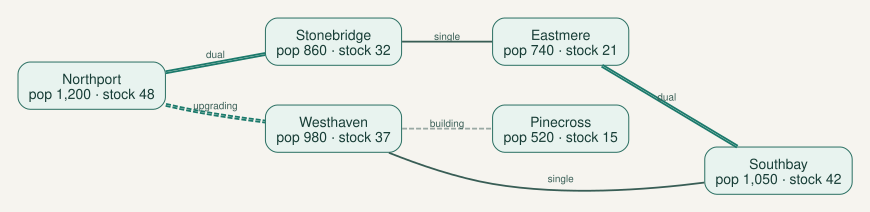

<p align="center">
  
</p>

<h1 align="center">Railway Network Simulator</h1>

<p align="center">
  A Java 21 simulation of growing towns, evolving railway infrastructure, and day-by-day freight movement.
</p>

<p align="center">
  <a href="https://github.com/Himath2002/railway-network-simulator/actions/workflows/ci.yml"></a>
  <a href="https://github.com/Himath2002/railway-network-simulator/releases"></a>
  
  
</p>

## The simulation

Railway Network Simulator turns a stream of infrastructure events into a live transport network. Towns appear and grow, warehouses extend local reserves, railways spend time under construction, and eligible single-track routes can be duplicated without suspending service.

Every simulated day follows one explicit pipeline:

1. receive and validate the day’s events;
2. apply accepted mutations to the network;
3. produce goods in every town;
4. move freight over routes that are operational that day;
5. advance railway lifecycle states;
6. print a deterministic summary and refresh the Graphviz snapshot when topology changes.

The design keeps infrastructure policy inside the domain rather than spreading lifecycle conditions across the simulation loop.

## At a glance

| Capability | Engineering focus |
| --- | --- |
| Event-driven growth | One validated grammar for towns, population, warehouses, construction, and duplication |
| Stateful infrastructure | Polymorphic construction, single-track, upgrading, and dual-track behavior |
| Directional capacity | Single tracks alternate direction; dual tracks carry freight both ways |
| Referential integrity | Railways and warehouses can only reference registered towns |
| Observable topology | Mutations update the reporter through an explicit Observer boundary |
| Dual presentation | Human-readable console summaries and machine-renderable Graphviz DOT |
| Deterministic testing | Injectable event, clock, input, output, path, and tick boundaries |

## Run it

### Requirements

- JDK 21
- No global Gradle installation—the repository includes the Gradle Wrapper

### Start the simulator

macOS or Linux:

```bash
./gradlew run
```

Windows:

```powershell
.\gradlew.bat run
```

The default event source produces a live stream. Press **Enter** at any time; the simulator completes the current day, prints its summary, and exits cleanly.

```text
Press Enter to stop after the current simulation day.

┌──────────────────────────────────────────┐
│        Railway Network Simulator         │
│  towns · track states · freight movement │
└──────────────────────────────────────────┘
```

When topology changes, the application writes:

```text
build/outputs/railway-network.dot
```

Render that file with Graphviz:

```bash
dot -Tsvg build/outputs/railway-network.dot \
  -o build/outputs/railway-network.svg
```

### Verify the project

```bash
./gradlew clean build
```

This compiles with Java lint warnings treated as errors, runs the JUnit suite, and executes focused PMD maintainability checks.

## Event language

Each event is a three-token record:

```text
event-type first-argument second-argument
```

| Event | Example | Result |
| --- | --- | --- |
| Found a town | `town-founding Northport 400` | Creates `Northport` and its initial warehouse |
| Change population | `town-population Northport 650` | Sets the registered town population |
| Construct a line | `railway-construction Northport Southport` | Starts a five-day build between existing towns |
| Duplicate a line | `railway-duplication Northport Southport` | Starts a five-day upgrade on an eligible single track |
| Found a warehouse | `warehouse-founding Northport 2500` | Adds bounded storage to an existing town |

Whitespace is normalized. Unknown event types, missing arguments, invalid numbers, duplicate entities, missing towns, self-links, duplicate routes, and premature duplication are rejected without corrupting network state.

## Railway lifecycle

<p align="center">
  
</p>

### Under construction

A new route remains unavailable for five completed simulation days. Its state owns the countdown and performs the transition to active service.

### Single track

One direction receives a capacity of 100 units each day. Direction alternates by day parity so both endpoints receive regular access without a separate scheduler.

### Upgrading

Duplication takes five completed days. The existing single track keeps operating throughout the upgrade, using the same alternating-direction rule.

### Dual track

Both directions receive a capacity of 100 units every day. A dual route is stable and cannot be duplicated again.

## Freight model

Each town produces one freight unit per resident on every simulated day:

```text
daily production = current population
```

Production is saturation-safe and retained in the town stockpile. When a route grants capacity, freight is taken from the town first and then from its registered warehouses until capacity or available stock is exhausted.

The simulator records transported units by origin for the daily report. Goods are treated as outbound network throughput rather than inventory deposited at the destination; this keeps the model focused on infrastructure capacity and lifecycle behavior.

## Architecture

<p align="center">
  
</p>

```text
src/
├── main/java/io/github/himathahangama/railnet/
│   ├── application/      composition root
│   ├── domain/
│   │   ├── entity/       towns, warehouses, and railways
│   │   ├── factory/      typed entity construction
│   │   └── state/        railway lifecycle policies
│   ├── input/            event-source boundary and live generator
│   ├── network/          registry, integrity, and application facade
│   ├── observer/         topology-change notification contracts
│   ├── presentation/     console summaries and Graphviz output
│   └── simulation/       day-level orchestration
└── test/java/io/github/himathahangama/railnet/
    └── ...               tests mirror production boundaries
```

Dependencies point toward stable contracts. Domain entities never read console input, write files, or know how the application is assembled. The simulation accepts abstractions and injected environmental dependencies, so a complete day can execute in milliseconds during tests.

Read [the architecture notes](docs/architecture.md) for invariants, dependency direction, and extension paths.

## Pattern map

| Pattern | Where it lives | Why it is useful here |
| --- | --- | --- |
| State | `domain/state` | Each railway lifecycle phase owns capacity, eligibility, transition, and graph semantics |
| Factory | `domain/factory` | Network orchestration creates typed entities without coupling to constructors |
| Observer | `observer`, `NetworkManager`, `NetworkReporter` | Topology mutations mark the graph view stale without hard-wiring file output |
| Facade | `NetworkManager` | One validated boundary coordinates registry and domain operations |
| Strategy boundary | `NetworkEventSource` | Live generation can be replaced by deterministic queues or other adapters |

## Network snapshot

<p align="center">
  
</p>

The image above is rendered directly from [`examples/network-snapshot.dot`](examples/network-snapshot.dot), using the same DOT conventions as the runtime reporter. It is documentation, not a manually illustrated substitute for application output.

## Engineering quality

- Java 21 toolchain and Gradle Wrapper for repeatable builds
- compiler linting with warnings promoted to failures
- focused JUnit tests for event generation, entities, states, integrity, reporting, and a complete simulation day
- PMD rules selected for correctness and maintainability
- GitHub Actions CI with wrapper validation and read-only permissions
- Dependabot coverage for Gradle and GitHub Actions
- local-only execution with no credentials, analytics, database, or network requests
- bounded entity state, defensive collection snapshots, and validated environmental boundaries
- generated graphs and runtime logs excluded from version control

## Extend it

### Add an event source

1. implement `NetworkEventSource`;
2. return one event at a time and `null` when the current batch is complete;
3. keep external protocol translation inside the adapter;
4. inject it into `Simulation`;
5. add deterministic boundary and malformed-input tests.

### Add a railway lifecycle phase

1. implement `RailwayState`;
2. define directional capacity and duplication eligibility;
3. make transitions explicit in `dayPassed`;
4. provide stable DOT attributes and a `RailwayStatus`;
5. test capacity, invalid endpoints, and the complete transition.

No console, registry, or factory rewrite is required for either extension.

## Security and privacy

Railway Network Simulator runs locally. It performs no network requests, stores no credentials, and collects no telemetry. Its main untrusted boundaries are event text, stop-signal input, and the configured graph path. Events are validated before mutation, generated output is UTF-8, and Graphviz identifiers are escaped before writing.

For responsible reporting, use the private flow described in [SECURITY.md](SECURITY.md).

## Project history

This repository is a publication-focused evolution of an earlier object-oriented software engineering prototype. The simulation rules and core algorithms remain the author’s original work; the package architecture, validation boundaries, lifecycle model, tests, reporting, and build pipeline were refined for maintainability and public review. Generated distributions, cached output, local logs, IDE metadata, and reference documents are intentionally excluded.

## Contributing

Focused issues and pull requests are welcome. Read [CONTRIBUTING.md](CONTRIBUTING.md) before changing event grammar, lifecycle timing, or freight semantics.

## Ownership

Copyright © 2025–2026 Himath Ahangama. All rights reserved.

The source is published for portfolio review and technical evaluation. No permission to copy, redistribute, or create derivative works is granted unless the author provides a separate written license.
